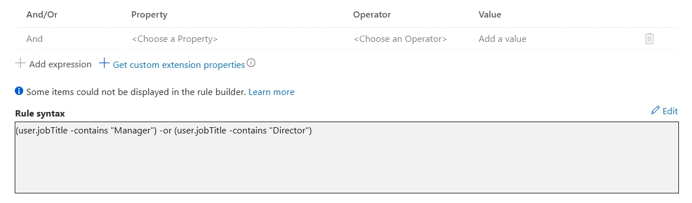
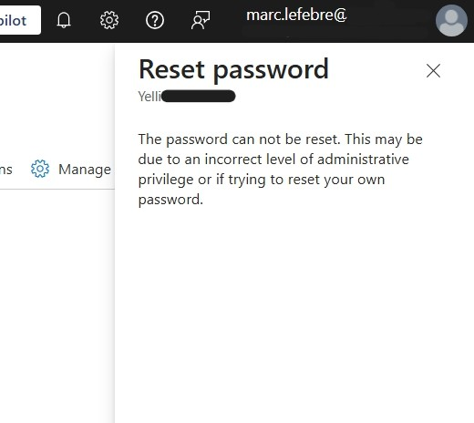
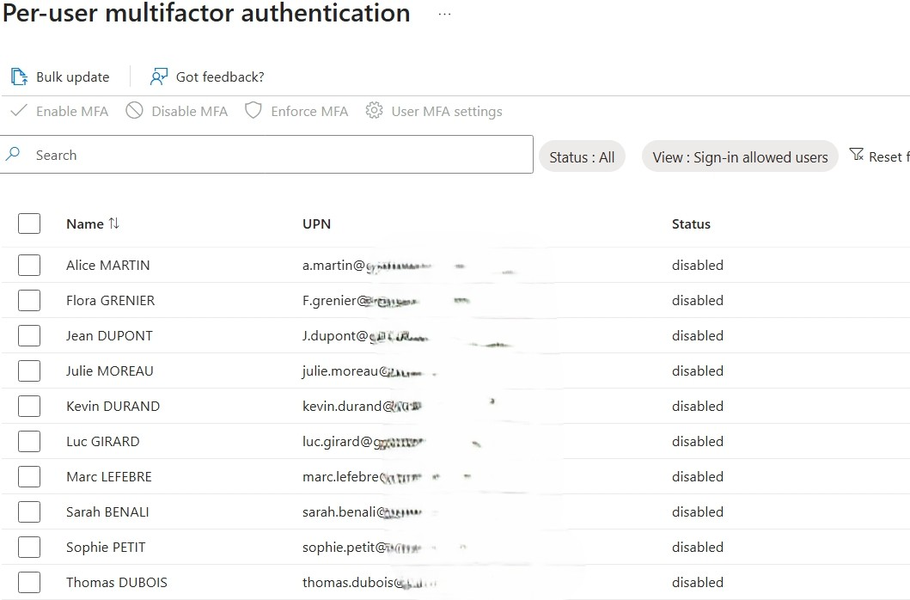
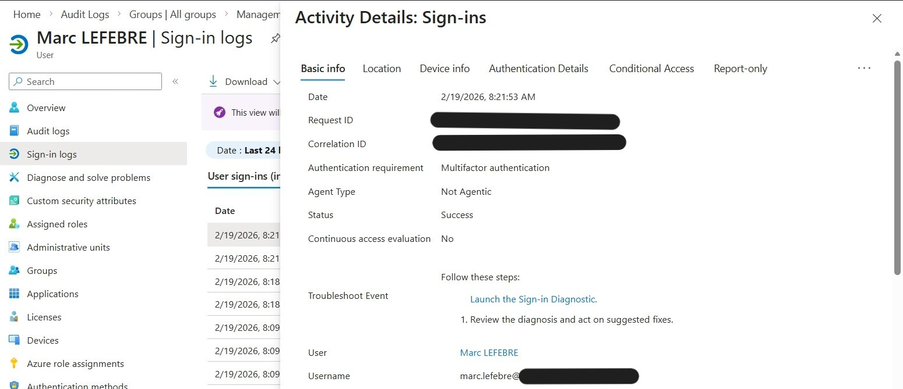

# 🛡️ Projet : EntraID Identity & Security Lab
*Simulation d'une infrastructure d'entreprise hybride (France/Canada) sur un tenant Microsoft 365 E5.*

## 📌 Objectifs du Projet
Ce laboratoire vise à démontrer la maîtrise de la gestion des identités, de l'automatisation des accès et de la sécurisation des privilèges administratifs (RBAC) dans un environnement Cloud moderne.

---

## 🚀 Phase 1 : Gouvernance des Identités & Automatisation
Mise en place d'une structure de 10 utilisateurs multi-régions avec automatisation des accès.

- **Groupes Dynamiques** : Configuration de règles basées sur les attributs (`City`, `JobTitle`).
- **Automatisation** : Suppression du provisionnement manuel pour les localisations géographiques.

> **📸 Preuve Technique : Règle de groupe dynamique avancée**
> 
> *Ici, on voit l'utilisation de l'opérateur `-contains` pour capturer tous les profils de management.*

---

## 🛡️ Phase 2 : Principe du Moindre Privilège (RBAC)
Délégation de droits sans compromettre la sécurité globale du tenant.

- **Délégation** : Attribution du rôle `User Administrator` à un compte technicien (Marc Lefebvre).
- **Test de Protection** : Vérification de la hiérarchie Entra ID (Impossibilité pour un Admin User de modifier/supprimer un Global Admin).

> **📸 Preuve Technique : Blocage de sécurité RBAC**
> 
> *Tentative de réinitialisation de mot de passe du Global Admin par le User Admin : Accès refusé par Azure.*

---

## 🔍 Phase 3 : Troubleshooting & Sécurité (The "MFA" Case)
Analyse critique des nouvelles politiques de sécurité Microsoft 2025.

- **Diagnostic** : Identification du blocage MFA via les `Sign-in Logs`.
- **Analyse** : Étude du paradoxe entre le portail Legacy et le "Mandatory MFA" imposé par Microsoft.

> **📸 Preuve Technique : Statut Legacy MFA (Trompeur)**
> 
> *Bien que désactivé ici, le MFA est forcé par les politiques globales de 2025.*

- **Résolution** : Configuration et validation des méthodes d'authentification forcées pour les rôles privilégiés.

> **📸 Preuve Technique : Log de connexion réussi avec MFA (Authenticator)**
> 
> *Analyse du flux : Validation du mot de passe + Validation du second facteur (MFA).*
