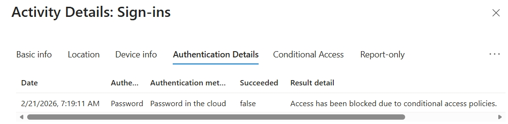

# 🛡️ Projet : EntraID Identity & Security Lab
*Simulation d'une infrastructure d'entreprise hybride sur un tenant Microsoft 365 E5.*

## 📌 Objectifs du Projet
Ce laboratoire démontre la maîtrise de la gestion des identités, de l'automatisation des accès et de la sécurisation des privilèges administratifs (RBAC) dans un environnement Cloud moderne.

---

## 🚀 Phase 1 : Gouvernance des Identités & Automatisation
Mise en place d'une structure de 10 utilisateurs multi-régions avec automatisation des accès via des règles dynamiques.

- **Groupes Dynamiques** : Configuration de règles basées sur les attributs (`JobTitle`).
- **Automatisation** : Utilisation de la syntaxe avancée pour capturer les profils de management.

> **📸 Preuve Technique : Syntaxe de la règle dynamique**
> 

---

## 🛡️ Phase 2 : Principe du Moindre Privilège (RBAC)
Délégation de droits granulaire et protection des comptes critiques.

- **Délégation** : Attribution du rôle `User Administrator` au compte Marc Lefebvre.
- **Test de Protection** : Vérification de l'impossibilité pour un Admin User de modifier un Global Admin.

> **📸 Preuve Technique : Échec de la réinitialisation (Protection hiérarchique)**
> 

---

## 🔍 Phase 3 : Troubleshooting & Sécurité (MFA & Logs)
Analyse des politiques de sécurité "Mandatory MFA" de Microsoft et diagnostic via les logs d'audit.

- **Le Paradoxe MFA** : Identification d'un statut "Disabled" sur le portail Legacy alors que la sécurité est appliquée au niveau du Tenant.

> **📸 Preuve Technique : Statut Legacy MFA (Affichage Trompeur)**
> 

- **Analyse des Logs** : Validation du succès de l'authentification forte (Authenticator) et décomposition des facteurs.

> **📸 Preuve Technique : Analyse du flux d'authentification (MFA Validé)**
> 
> 
> *On confirme ici la validation successive du mot de passe et du second facteur (code OATH).*

---

## 💰 Phase 4 : Gestion des Licences par Groupe (Scalability)
Industrialisation de l'attribution des ressources via le Microsoft 365 Admin Center.

- **Stratégie** : Attribution des licences Microsoft 365 E5 directement au groupe `Lyon`.
- **Héritage** : Vérification que les utilisateurs reçoivent leurs droits via l'appartenance au groupe.

> **📸 Preuve Technique : Assignation au groupe et statut hérité**
> 
> 
> *L'utilisateur reçoit ses licences automatiquement via l'appartenance au groupe.*

---

## 🌍 Phase 5 : Sécurité Géographique (Geofencing via Conditional Access)
Mise en place d'une stratégie de "Zero Trust" basée sur la localisation réseau.

- **Objectif** : Bloquer toute tentative de connexion provenant de zones géographiques non autorisées (hors France/Canada).
- **Implémentation** : Création d'une "Named Location" regroupant les pays autorisés et application d'une règle de blocage globale (Exclude mode).
- **Test de pénétration** : Simulation d'une attaque depuis les États-Unis via VPN Proton.

> **📸 Preuve Technique : Blocage géographique actif**
> 
> 
> *Analyse : Le code d'erreur 53003 confirme que la politique d'accès conditionnel a interrompu la session malgré un mot de passe correct.*

---

## 🔐 Phase 6 : Protection ciblée du Management
Mise en place d'une couche de sécurité supplémentaire pour les comptes à hauts privilèges.

- **Logique** : Forcer le MFA spécifiquement pour le groupe dynamique `Management`.
- **Résultat** : Superposition réussie des politiques de sécurité.

> **📸 Preuve Technique : Validation de la politique personnalisée**
> 
> *Preuve : On observe le statut "Success" pour la politique `REQUIRE_MFA_FOR_MANAGEMENT` lors de la connexion de l'utilisateur.*
